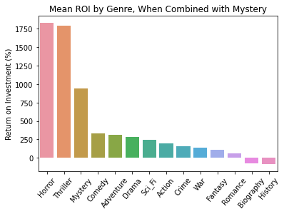

# Film Analysis

**Author**: [Matt LeRoi](mailto:mcleroi@gmail.com) 

# Business Understanding

The goal of this project is to advise ACME Co, who are new to the film industry, on how they can maximize their odds of making financially sucessful films. 

# Data Understanding

This project uses two data sources: [financial data](./data/tn.movie_budgets.csv.gz) from The-Numbers.com and [detailed film data](./data/im.db) from IMDB.com. The financial data includes the cost of making each film and the domestic and worldwide grosses. The detailed film data includes things like the runtime, applicable genres, and user ratings. 

## Data Preparation

The two files are trimmed of unecessary information and formatted in a consistent manner to be merged later. This includes converting strings to numbers and dates, and renaming columns to match between the two data sources.

# Exploratory Data Analysis

The profit and return on investment (ROI = profit as a percentage of the original budget) are calculated for each film and the two data sources are merged. Models are created for each output - profit and ROI - showing the statistically significant factors and the effect of each. 

# Conclusion

Overall, there are more profitable films than unprofitable ones, so this appears to be a good business to go into. 


Certain genres and combinations of genres perform better at the box office, however, and both runtime and user rating can also have an effect on the financial success of a film. 

                              

   

## Limitations

The data sets these conclusions and recommendations are based on are not comprehensive. They only include films that were released to theaters, for example, not the projects that were abandoned before completion, went straight to video, or those that couldn't find a distributor. These are all possible scenarios when beginning production on a film and are generally unprofitable routes. Also note that this analysis is based on thousands of films and the conclusions show averages and statistically significant findings. No amount of analysis or preplanning will guarantee that any individual film will be successful. These recommendations are only intended to provide insights to increase the odds that a film is a financial success.

## Recommendations

To maximize return on investment:

-  Genre: horror + mystery

-  Rating: higher = better

-  Runtime: 75-90 minutes


To maximize net profit:

-  Budget: higher budget = higher net profit

-  Genre: Animation or Sci-Fi

-  Rating: higher = better

-  Animation runtime: 105-120 minutes

-  Sci-Fi runtime: 120-135 minutes


## Next Steps

This analysis should provide some initial guidance on general direction, but there is a lot more to do! Further analysis may show which writers, directors, or actors are the most bankable, for example. It may also show more fine details - a horror-romance might be unlikely to work out, but should there be no element of romance whatsoever or simply not so prominent that it gets listed as a genre? With more information guiding the many small decisions left to be made, here are some next steps:

- Decide the approach: start with a $1M horror-mystery or go straight for a $100M animated or sci-fi blockbuster?
- Begin sourcing talent: start with writers and directors, then find actors and crew once the project starts to take shape.
- Refine your ideas: work with the writer and director to narrow down the scope from the broad genres above.
- Start production: time to start filming!

## For More Information

See the full analysis in the [Jupyter Notebook](./Film_analysis.ipynb), review this [presentation](./Slides.pdf).

For additional info, contact Matt LeRoi at [mcleroi@gmail.com](mailto:mcleroi@gmail.com)

```
- [data](./data/)
├── pics
├── README.md
├── Slides.pdf
└── Film_analysis.ipynb
```
